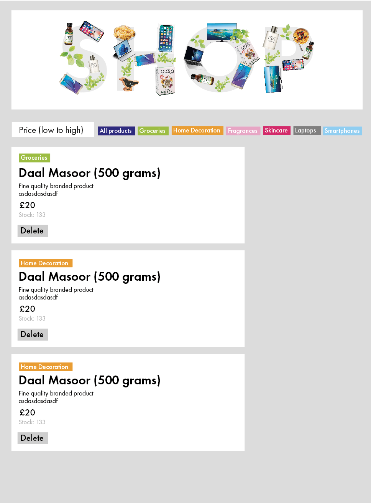
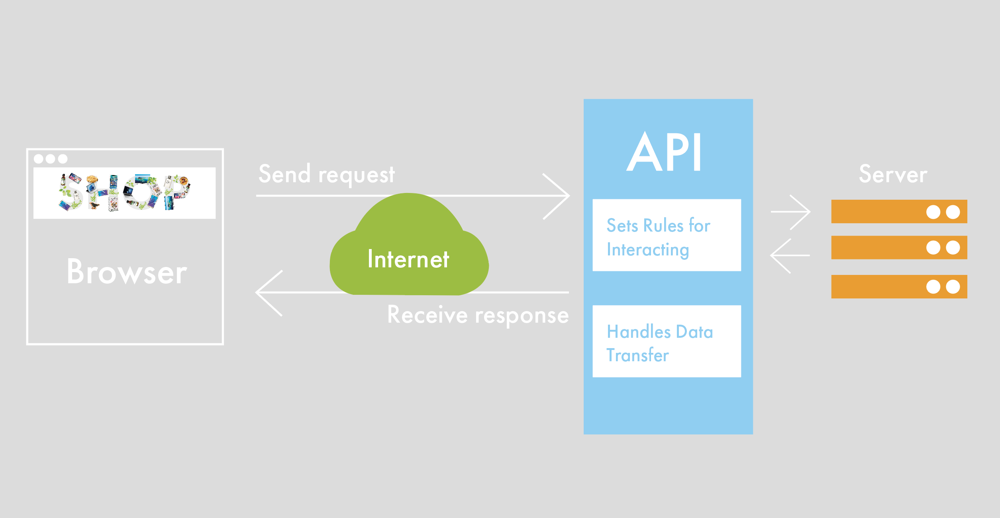

# leShop

"View Products" a react app build to allow users to view a list of products
 from Products API: https://dummyjson.com/docs/productswith additional With additional functionality of sort, search, delete and filter. 
 
## Tech stack

* [React](https://reactjs.org/) for front end user interface.
* [Node.js](https://nodejs.org/en/) for the server environment(v18.12)
* NPM (8.19.2)
* Nodemon (2.0.20) to reload the server automatically.


## User Stories
```
As a leShop user,
So I can view all products,
I would like to view all products.
```

```
As a leShop user,
So that I can retrieve and view products from the API
I would like to see a display on the product page by title and in ascending order
```

```
As a leShop user,
So I can see the vital information for each product,
I would like a display of category, title, description, price and stock.
```

```
As a leShop user,
So I can see the view products by category,
I would like button functionality to see products by category.
```

```
```

## Diagrams

### Wireframe Diagram
  

### Frontend & API Diagram
 

## How to run this project

Clone this repository:

```
git clone https://github.com/paulinejdavis/leShop.git

```

Run the frontend:

```
cd frontend
npm install
npm start
```

 Browse to [http://localhost:3000](http://localhost:3000)
